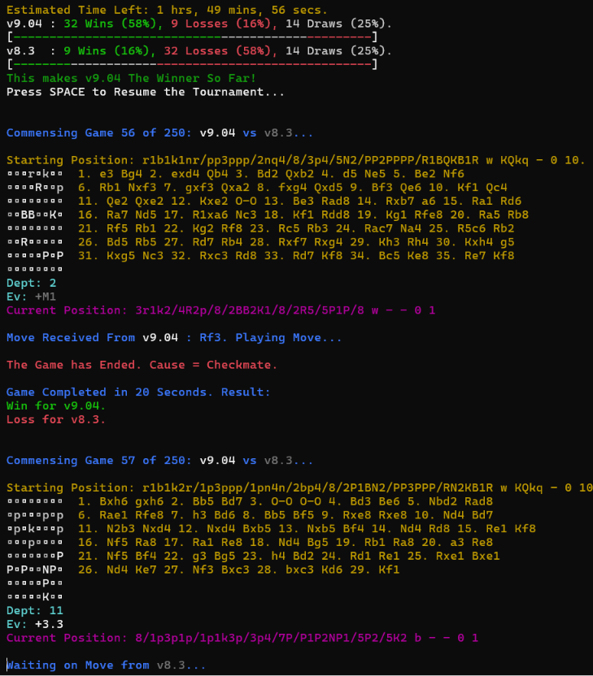

# Chess AI Swiss-Style Tournament & Benchmarking System


-%23E10098.svg?style=for-the-badge)

---

A small program that allows multiple versions of my [**Chess AI**](https://github.com/AlfieKunz/Chess-Game-AI) to compete in a **tournament system**, across a customisable variety of starting positions and thinking time. Supports a wide variety of AI models across various legacy designs and formats in an intuitive **'plug and play'** methodology, with live game showcases and statistics via a colourful, information-rich terminal log. To help with the smooth running of games, 'arbiter' controls can be managed via the program, allowing for termination of games from broken or illegal moves, and across the full spread of chess win/draw conditions.

This work is self-motivated and self-funded, and forms a small part of my 'commercial grade' [**Chess Game & Artificial Intelligence**](https://github.com/AlfieKunz/Chess-Game-AI): new features, flavours of AI, and possible bugs are always tested and compared using this system, which helps me build the strongest AI possible! :) Data from this program can also be used to calculate a relative Elo score for each AI version.

This project is written primarily in VB.NET as a Visual Studio console application.  
Also attached is the Python code for generating robust, equal, and 'fun' starting positions, using Stockfish.

<p align="center">
  
</p>

---

## Features and Highlights

### Version Comparer
✅ Fully configurable head-to-head Chess AI tournaments, with granular controls of AI models and their settings (eg: transposition tables, aspiration window width, PVS, bitmasked move generation, move-reduction thresholds, etc) for controlled configuration testing), opening positions, and time control.  
✅ Unbiased games handling, by allowing each player to play as both white and black for each position (swaps once half the match-up is complete).  
✅ "Plug & Play" mechanics for easily loading two independently versioned AI builds side-by-side via separate namespace imports — swap either engine without touching the tournament logic.  
✅ Detection and graceful external adaptation of legacy Chess AI features, such as old approaches to multithreading (five per-depth thread allocation, vs newer iterative deepening), Option Strict, logarithmic material-adaptive starting search depth (CalculateAbsoluteDepth), extending of allocated time if needed, etc.  
✅ Full chess endstate detection: checkmates, stalemates (no legal moves, or insufficient material), threefold repetitions, and the 50-move rule. For legacy AIs, the latter two are handled externally via a robust Zobrist hashing engine (random 64-bit key generation, full position/castling-rights/en-passant hashing), and per-game position tracking.  
✅ Native iterative deepening and advanced forced-mate completion (and future depth allocation) for modern engines.  
✅ Escalated warnings if a player is unable to make a move in the allocated time (initial warning, emergency forced 2-ply search).  
✅ Robust handling of invalid moves and games: detection of illegal moves, and safe crashing of players, logging, and exclusion from the results.  
✅ Well-packed, colourful, and intuitive live showcase of each game, using a colour-coded Unicode board rendering, real-time search depth and evaluation, live-scrolling (self-refreshing) PGN transcript, and initial & current FEN.  
✅ In-depth tournament statistics available throughout the match-up, including win-loss graphics, elapsed time, and AI 'outclasses' (for where a player won a position as both white and black).  
✅ Live pause / resume feature (via SPACE), with updated scorings and tournament statistics (including elapsed and extrapolated remaining tournament time).  

### Opening Position Generator
✅ Standalone tool for building a curated bank of fair, balanced starting positions (from top-level human games from the Lichess Elite Database) to feed the tournament.  
✅ Filtering of equal positions via evaluations from Stockfish.  
✅ Early-game-biased random move sampling, within a configurable move-number window.  
✅ Filtering of minimum piece count, filtering out over-simplified endgame positions.  
✅ Applying a minimum remaining-game-length filter, to exclude positions that don't have much contest ahead of them.  
✅ Randomised game-skipping between samples to maximise positional diversity.  
✅ Automatic PGN wraparound if the source database is exhausted before the target count is reached.  
✅ Live progress logging and total-runtime benchmarking.  

---

## Project Showcase

> **Project Results:**  A vast number of tournaments have been run across many versions of my Chess AI, from v5.2 to the latest version (including many debug versions and pre-releases). You can see the <a href="https://docs.google.com/document/d/1l2azNiomihHmkGiXxQ9ZlNTO_YLcn6JF" target="_blank" rel="noopener noreferrer">**results of those tournaments here**</a>.

The best way to interact with this program for full control is directly through the source code - see the instructions below.

> **Program Controls:**
>1) First, drag and drop the relevant AI files into either the "AIPlayer1" or "AIPlayer2" folder, from either a model of choice from the "AI Archives" folder, or from any [Chess AI GitHub release](https://github.com/AlfieKunz/Chess-Game-AI/releases) succeeding v9.0. In the latter case, specifically copy the files {"AI.vb", "AILookupTables.vb", "CoreMethods.vb", "GameHistory.vb", "PieceLegalMoveGenerators.vb", "SubObjects.vb"}.
>2) Open the project solution in your IDE of choice, and click "Clean Solution" before building (to reset the AIPlayer?.vbproj files).
>3) To change any AI settings for a fully customisable tournament, navigate to the AdjustIndividualAISettings subroutine in "Program.vb" and adjust the AI1Settings or AI2Settings classes directly. For more information on what settings can be adjusted, and what each of them does, see the "AISearchSettings" class in the "SubObjects.vb" file of each AI player.
>4) Run the project, and input the number of games and maximum AI thinking time per move to run the tournament! N/2 opening positions will be loaded for "NoMatches = N", where each position is played twice (once for Player 1 as white, the other as black).
>5) At any time, press SPACE to pause the simulation (at the conclusion of the current game) to output the current tournament statistics, and estimated time of completion. Then, press SPACE again to instantly resume the tournament.

---

## Installation and Folder Structure

### Required Software: Visual Studio (.NET 8.0).

To install, simply clone this repository using the following terminal prompts.
```bash
git clone https://github.com/AlfieKunz/Chess-Tournament
cd Chess-Tournament
```
Then, simply open the "VersionComparer.sln" file in Visual Studio.

Feel free to also fork this repository, open an issue, or submit pull requests. All contributions welcome! :)  
To better navigate this project, please see below for the related folder structure.

```
Chess-Tournament
├─ AI Archives                    // Full list of relevant AI files for a wide variety of legacy AI models, from v5.2 (A-Level NEA release) to v10.0. Details of each version in the "Tournament Results" document as mentioned above
├─ AIPlayer1                      // Folder containing all relevant AI files for "Player 1" in the tournament. Do not touch any non-AI related files
├─ AIPlayer2                      // Ditto for "Player 2"
├─ VersionComparer                //
│  ├─ OpeningPositionGenerator.py // Code for generating the fair, balanced starting positions that are used in the chess tournament (full set for Player 1 starting as white, full set for black)
│  └─ Program.vb                  // Main program code, for loading & interacting with AI models, and preparing, running, and analysing the tournament's games
└─ VersionComparer.sln            // Main VS code solution
```

---

## References & Inspiration

This work is self-motivated and self-funded. If you use this code or data in your work, please cite the associated preprint:

**Text Citation:**
> Kunz, A. (2025). *Chess AI Swiss-Style Tournament & Benchmarking System*. Available at https://github.com/AlfieKunz/Chess-Tournament.

**BibTeX:**
```bibtex
@software{Kunz2025ChessTournament,
  title = {Chess AI Swiss-Style Tournament & Benchmarking System},
  author = {Kunz, Alfie},
  year = {2025},
  url = {https://github.com/AlfieKunz/Chess-Tournament}
}
```